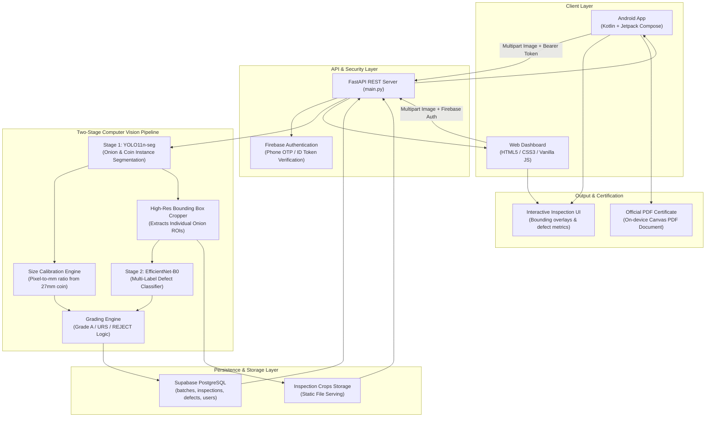

# 🧅 PyazLens (प्यास लेंस) — AI-Powered Onion Quality Inspection & Grading Platform

[](https://www.sih.gov.in/)
[](https://fastapi.tiangolo.com/)
[](https://pytorch.org/)
[](https://developer.android.com/jetpack/compose)
[](https://supabase.com/)
[](https://firebase.google.com/)

> **PyazLens** is an end-to-end, computer-vision-driven agricultural inspection and certification system developed for **Smart India Hackathon (Problem Statement: SIH26031)**. It provides real-time, objective, and standardized onion sizing, defect classification, grade evaluation, and instant digital certification for farmers, mandis, traders, and export quality regulators.

---

## 📌 Table of Contents

- [Overview & Problem Statement](#-overview--problem-statement)
- [Key Features](#-key-features)
- [System Architecture](#-system-architecture)
- [Computer Vision Pipeline](#-computer-vision-pipeline)
  - [Model 1: YOLO11 Instance Segmentation & Sizing](#model-1-yolo11-instance-segmentation--size-calibration)
  - [Model 2: EfficientNet-B0 Defect Classification](#model-2-efficientnet-b0-defect-classification)
  - [Automated Grading Standards Engine](#automated-grading-standards-engine)
- [Project Components](#-project-components)
  - [1. Mobile Application (Android / Jetpack Compose)](#1-mobile-application-android--jetpack-compose)
  - [2. Backend Service (FastAPI & PyTorch)](#2-backend-service-fastapi--pytorch)
  - [3. Web Portal (Landing & AI Scanner)](#3-web-portal-landing--ai-scanner)
- [Repository Structure](#-repository-structure)
- [API Reference](#-api-reference)
- [Getting Started](#-getting-started)
  - [Backend Setup](#backend-setup)
  - [Android App Setup](#android-app-setup)
  - [Web Portal Setup](#web-portal-setup)
- [Tech Stack](#-tech-stack)
- [Authors & Acknowledgements](#-authors--acknowledgements)

---

## 🌾 Overview & Problem Statement

In traditional agricultural supply chains and APMC Mandis across India, **onion sorting and grading is carried out manually**. This manual process suffers from several critical bottlenecks:

- **Subjectivity & Human Error:** Inconsistent grading between inspectors leads to unfair pricing and farmer disputes.
- **Labor Intensive & Slow:** Inability to inspect high-volume harvest batches quickly during peak seasons.
- **Post-Harvest Waste:** Undetected rotting, sprouting, or fungal infections spread throughout stored batches, causing massive post-harvest losses.
- **Lack of Digital Audit Trail:** No tamper-evident digital certificates or batch metrics to guarantee export standards or bank financing.

### The PyazLens Solution

PyazLens eliminates subjectivity by using a **two-stage AI inspection pipeline** paired with a standard reference object (e.g., standard Indian coin) for sub-millimeter size calibration. The system automatically detects defects, measures diameters, assigns official quality grades (**Grade A**, **Grade URS**, or **REJECT**), logs full audit histories to Supabase, and compiles tamper-evident PDF inspection certificates right from a mobile device or web browser.

---

## ✨ Key Features

- **🎯 Dual-Stage Neural Architecture:**
  - **YOLO11 Nano Segmentation:** Segments individual onions and detects reference calibration coins in real time.
  - **EfficientNet-B0 Deep CNN:** Classifies fine-grained multi-label surface defects on cropped onion masks.
- **📏 Reference Object Size Calibration (Without 3D Depth Hardware):**
  - Uses a standard Indian coin (default diameter: `27.0 mm`) placed alongside the sample to dynamically calculate pixel-to-millimeter ratios and compute accurate onion diameters.
- **🔬 6-Class Defect Analysis:**
  - Detects **Rotten**, **Sprouted**, **Cut/Crack**, **Skin Damage**, **Sunburned**, and **Misshapen** onions with individual probability scoring.
- **🏷️ Automated Agricultural Grading:**
  - Evaluates each bulb according to mandi standards into **Grade A (45–65 mm, blemish-free)**, **Grade URS (Under/Over Regular Specification)**, or **REJECT** (critical defects such as rot, sprouting, cuts).
- **📱 Native Modern Android Experience:**
  - Built with **Jetpack Compose (Material 3)**.
  - Live CameraX viewfinder with on-screen alignment guides for coin and onion placement.
  - Multi-language localization (English and Hindi) tailored for grassroots agricultural adoption.
  - On-device **tamper-evident PDF certificate generator** (`PdfReportGenerator.kt`) with instant WhatsApp and Bluetooth sharing.
- **🌐 Responsive Web Dashboard:**
  - Glassmorphism UI with live drag-and-drop AI scanner, batch analytics, and interactive visual crop inspector.
- **☁️ Robust Cloud Backend & Audit Trail:**
  - FastAPI asynchronous server, Firebase Authentication (Phone OTP & Token validation), and Supabase PostgreSQL schema storing batches, individual onion measurements, and defect records.

---

## 🏛️ System Architecture



---

## 🧠 Computer Vision Pipeline

### Model 1: YOLO11 Instance Segmentation & Size Calibration

- **Model Architecture:** Ultralytics YOLO11 Nano Segmentation (`yolo11n-seg`).
- **Classes:** `onion`, `coin`.
- **Function:**
  1. Detects and segments every visible onion and reference coin in the captured frame.
  2. Measures coin contour diameter in pixels to calculate the metric scaling factor:
     $$\text{Scale Ratio} = \frac{27.0\text{ mm}}{\text{Detected Coin Diameter (px)}}$$
  3. Calculates true physical diameter for every segmented onion:
     $$\text{Onion Diameter (mm)} = \text{Onion Diameter (px)} \times \text{Scale Ratio}$$

### Model 2: EfficientNet-B0 Defect Classification

- **Model Architecture:** Transfer-learned `efficientnet_b0` with a custom 6-output multi-label classification head.
- **Classes Analyzed:**
  1. 🛑 **Rotten:** Fungal, bacterial, or soft-tissue decay.
  2. 🌱 **Sprouted:** Internal shoots breaking dormancy.
  3. 🔪 **Cut / Crack:** Mechanical injury during harvest/transport.
  4. 🧅 **Skin Damage:** Peeled, ruptured outer tunic.
  5. ☀️ **Sunburned:** Greenish or bleached sun scald areas.
  6. ⚠️ **Misshapen:** Double bulbs or abnormal structural deformities.
- **Input:** $224 \times 224$ normalized cropped onion patches extracted from Stage 1 masks.

### Automated Grading Standards Engine

Each onion is graded through prioritized deterministic rules based on APMC/export standards:

| Grade | Size Range (Diameter) | Defect Condition | Action / Status |
| :--- | :--- | :--- | :--- |
| **REJECT** | Any size | Rotten $\ge 0.50$, Cut/Crack $\ge 0.50$, Sprouted $\ge 0.50$ | Discard / Segregate |
| **GRADE A** | **$45.0\text{ mm} - 65.0\text{ mm}$** | No critical defects, minimal surface blemishes | Premium Market & Export |
| **GRADE URS** | Outside $45-65\text{ mm}$ | Fit for consumption, no rot/sprout/cracks | Domestic Sale / Food Processing |

---

## 📦 Project Components

### 1. Mobile Application (Android / Jetpack Compose)

- **Location:** `PyazLens/`
- **Tech:** Kotlin, Jetpack Compose, CameraX, Retrofit2, OkHttp3, Coil, Native `PdfDocument`.
- **Highlights:**
  - **Camera Viewfinder:** Built-in guidance reticle showing exact positioning for onions and reference coin.
  - **Multi-lingual Support:** Switch between English and Hindi (`data/language/`).
  - **Inspection Result Screen:** Visual cards with onion thumbnail crops, badge chips, and defect confidence bars.
  - **Certified PDF Generation:** Multi-page PDF created on-device using Android Canvas, including batch summary, quality charts, timestamp, and signature lines.

### 2. Backend Service (FastAPI & PyTorch)

- **Location:** `backend/`
- **Tech:** FastAPI, Uvicorn, PyTorch, Torchvision, Ultralytics, Supabase Python Client, Firebase Admin SDK.
- **Highlights:**
  - End-to-end `/analyze` endpoint performing segmentation, cropping, classification, grading, and DB persistence in a single pass.
  - Firebase token verification middleware (`get_authenticated_profile`).
  - Automated directory management for crop inspection storage (`inspection_crops/`).

### 3. Web Portal (Landing & AI Scanner)

- **Location:** `website/`
- **Tech:** Modern HTML5, Responsive Vanilla CSS, JavaScript (ES6+), Firebase Web SDK.
- **Highlights:**
  - Live AI Scanner interface allowing users to upload batch photos and review inspection results directly.
  - Configured for Vercel deployment with serverless proxy routing (`vercel.json`).

---

## 📂 Repository Structure

```plaintext
SIH26031/
├── PyazLens/                       # Native Android Application (Kotlin + Compose)
│   ├── app/
│   │   ├── src/main/java/com/example/pyazlens/
│   │   │   ├── data/               # Models, Retrofit Network Client, PDF Generator
│   │   │   │   ├── language/       # Localization (English & Hindi)
│   │   │   │   ├── network/        # API Request/Response Models
│   │   │   │   └── pdf/            # PdfReportGenerator.kt (Canvas PDF Export)
│   │   │   ├── navigation/         # NavHost & Screen Routes
│   │   │   └── ui/                 # Jetpack Compose Screens
│   │   │       ├── home/           # Dashboard Screen
│   │   │       ├── scan/           # CameraX Live Capture Screen
│   │   │       ├── result/         # Inspection Results & Defect Breakdown
│   │   │       ├── history/        # Past Scans & History Filter
│   │   │       └── language/       # Language Selection UI
│   │   └── build.gradle.kts
│   └── build.gradle.kts
│
├── backend/                        # Cloud Inspection API
│   ├── model/                      # Deployed Model Weights
│   │   ├── model1/best.pt          # YOLO11n Instance Segmentation
│   │   └── model2/best.pt          # EfficientNet-B0 Defect Classifier
│   ├── services/
│   │   ├── grading_service.py      # Quality Grading & Batch Summarization Logic
│   │   └── model2_service.py       # Defect Prediction Inference Pipeline
│   ├── database.py                 # Supabase PostgreSQL Integration & Queries
│   ├── main.py                     # FastAPI Application Endpoints & Auth Middleware
│   ├── requirements.txt            # Python Dependencies
│   └── vercel.json                 # Deployment Configuration
│
├── website/                        # Web Dashboard & AI Scanner
│   ├── image/                      # Assets & Logos
│   ├── index.html                  # Landing Page & Scanner UI
│   ├── style.css                   # Glassmorphic Styling
│   ├── script.js                   # Interactive UI & Backend API Client
│   └── vercel.json                 # Vercel API Proxy Rewrites
│
├── OnionModel/                     # YOLO11 Model Training & Experimentation
│   ├── notebooks/                  # Training, Size Calibration & Evaluation Notebooks
│   └── results/                    # Validation Metrics, Confusion Matrices, Plots
│
├── OnionModel2F/                   # Defect Classifier Training
│   ├── notebook/                   # PyTorch EfficientNet Training Notebooks
│   └── onion_defect_classifier_BEST.pt
│
└── .gitignore                      # Git Ignore Configuration
```

---

## 🚀 API Reference

| Method | Endpoint | Description | Auth Required |
| :--- | :--- | :--- | :--- |
| `GET` | `/` | API Health check & service status | No |
| `POST` | `/analyze` | **Full Pipeline:** Segments onions, classifies defects, calculates diameters, grades batch, and records to Supabase | Yes (Bearer Token) |
| `POST` | `/detect` | Runs Stage 1 YOLO segmentation & metric sizing only | Yes (Bearer Token) |
| `POST` | `/crops` | Crops individual onion image regions from input image | Yes (Bearer Token) |
| `GET` | `/users/{id}/inspections` | Retrieves inspection history for an authenticated user | Yes (Bearer Token) |
| `GET` | `/inspections/{id}` | Fetches detailed metrics and onion crops for a specific inspection | Yes (Bearer Token) |
| `DELETE`| `/inspections/{id}` | Deletes an inspection record | Yes (Bearer Token) |
| `POST` | `/auth/send-otp` | Sends phone verification code | No |
| `POST` | `/auth/verify-otp` | Verifies phone OTP | No |
| `POST` | `/auth/firebase` | Authenticates/registers user profile via Firebase UID | No |

---

## 🛠️ Getting Started

### Prerequisites

- **Python:** 3.10 or 3.11
- **Android Studio:** Ladybug (2024.2+) or newer with JDK 17
- **Database:** [Supabase](https://supabase.com/) project with PostgreSQL
- **Authentication:** [Firebase](https://firebase.google.com/) project credentials

---

### Backend Setup

1. **Navigate to the backend directory:**
   ```bash
   cd backend
   ```

2. **Create and activate a virtual environment:**
   ```bash
   python -m venv venv
   # On Windows:
   .\venv\Scripts\activate
   # On Linux/macOS:
   source venv/bin/activate
   ```

3. **Install dependencies:**
   ```bash
   pip install -r requirements.txt
   ```

4. **Configure environment variables:**
   Create a `.env` file in the `backend/` directory:
   ```env
   SUPABASE_URL="https://your-supabase-project.supabase.co"
   SUPABASE_KEY="your-supabase-anon-or-service-role-key"
   ```

5. **Place Firebase credentials:**
   Ensure your Firebase Admin service account key is saved at `backend/firebase-service-account.json`.

6. **Start the API server:**
   ```bash
   uvicorn main:app --host 0.0.0.0 --port 8000 --reload
   ```
   The interactive API docs will be accessible at `http://localhost:8000/docs`.

---

### Android App Setup

1. Open **Android Studio**.
2. Select **Open** and choose the `PyazLens/` directory.
3. Place your `google-services.json` inside `PyazLens/app/`.
4. Configure your backend URL in `PyazLens/app/src/main/java/com/example/pyazlens/data/network/RetrofitClient.kt`:
   ```kotlin
   private const val BASE_URL = "http://YOUR_SERVER_IP:8000/"
   ```
5. Sync Gradle and run the app on an Android device or emulator with Camera support (API Level 24+).

---

### Web Portal Setup

1. **Navigate to the website directory:**
   ```bash
   cd website
   ```
2. **Serve locally:**
   ```bash
   # Using Python built-in HTTP server:
   python -m http.server 5500
   ```
3. Open `http://localhost:5500` in your web browser.

---

## 💻 Tech Stack

| Domain | Technologies |
| :--- | :--- |
| **Computer Vision & Deep Learning** | Ultralytics YOLO11, PyTorch, Torchvision, OpenCV, PIL |
| **Backend & Microservices** | FastAPI, Uvicorn, Python 3.10+, Pydantic |
| **Database & Cloud Storage** | Supabase (PostgreSQL), Firebase Admin SDK |
| **Mobile Application** | Kotlin, Jetpack Compose, Material 3, CameraX, Retrofit2, OkHttp3, Coil, Native Android `PdfDocument` |
| **Web Dashboard** | HTML5, Vanilla CSS3, JavaScript (ES6+), Firebase Web Auth, Vercel |

---

## 👥 Authors & Acknowledgements

- **Team PyazLens** — Developed for **Smart India Hackathon (SIH 2026)** under **Problem Statement SIH26031**.
- Special thanks to the Ministry of Consumer Affairs, Food & Public Distribution, and the agricultural research community for guidelines on APMC grading norms.